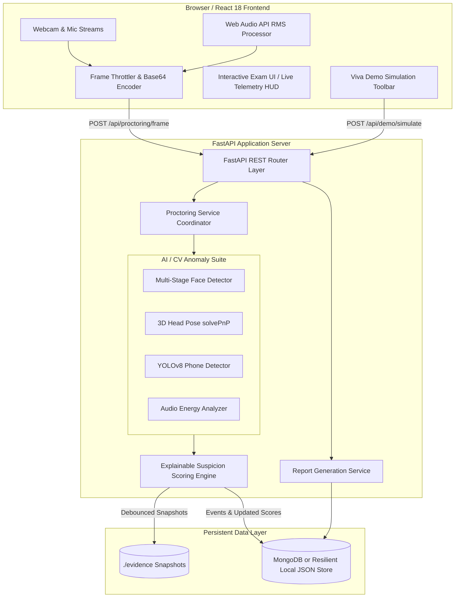
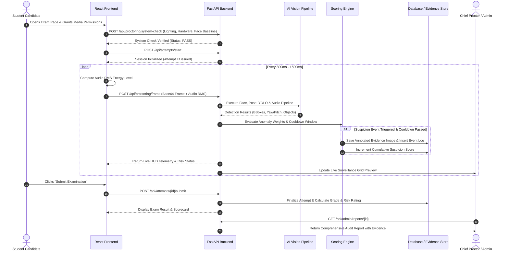
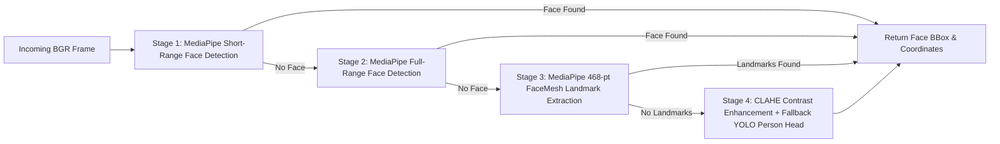
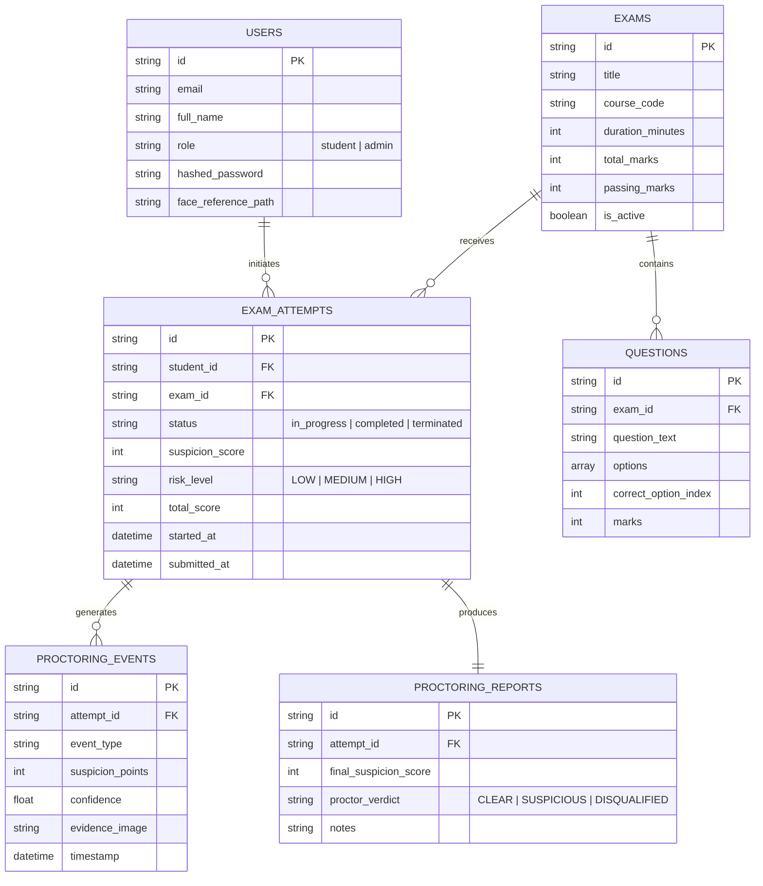

# Comprehensive Project Documentation
## AI-Based Smart Examination Proctoring System
### Using Computer Vision, Deep Learning, and Machine Learning

---

## Table of Contents
1. [Executive Summary & Abstract](#1-executive-summary--abstract)
2. [Problem Statement & Motivation](#2-problem-statement--motivation)
3. [System Requirements Specification (SRS)](#3-system-requirements-specification-srs)
   - 3.1 Functional Requirements
   - 3.2 Non-Functional Requirements
   - 3.3 Hardware & Software Prerequisites
4. [System Architecture & Design](#4-system-architecture--design)
   - 4.1 High-Level Architecture Diagram
   - 4.2 End-to-End Data Flow & Sequence Diagram
   - 4.3 Component Breakdown
5. [AI & Computer Vision Technical Pipeline](#5-ai--computer-vision-technical-pipeline)
   - 5.1 Multi-Stage Face & Presence Detection
   - 5.2 3D Head Pose & Gaze Estimation (`solvePnP`)
   - 5.3 Mobile Phone & Prohibited Device Detection (YOLOv8 + Temporal Tracking)
   - 5.4 Biometric Identity Verification
   - 5.5 Ambient Acoustic Energy Analysis
6. [Explainable Suspicion Scoring Engine](#6-explainable-suspicion-scoring-engine)
   - 6.1 Scoring Matrix & Weight Allocations
   - 6.2 Debounce & Cooldown Algorithm
   - 6.3 Risk Classification Tiers
7. [Database Architecture & Schema Design](#7-database-architecture--schema-design)
   - 7.1 Hybrid Storage Engine (MongoDB + Local JSON Store)
   - 7.2 Entity Schemas
8. [REST API Specification](#8-rest-api-specification)
9. [User Interface & Experience Flow](#9-user-interface--experience-flow)
   - 9.1 Student Workflow
   - 9.2 Administrator & Human Proctor Workflow
   - 9.3 Viva / Demonstration Mode
10. [Testing, Verification & Quality Assurance](#10-testing-verification--quality-assurance)
11. [Ethical Considerations & Limitations](#11-ethical-considerations--limitations)
12. [Conclusion & Future Scope](#12-conclusion--future-scope)

---

## 1. Executive Summary & Abstract

The **AI-Based Smart Examination Proctoring System** is an enterprise-grade automated academic integrity and online evaluation platform. As remote examinations become standard in academic institutions, maintaining credibility without invasive surveillance or unwarranted automated disqualification is critical.

This system monitors student behavior during examinations using real-time computer vision and acoustic telemetry. Rather than applying a black-box penalty, it features an **Explainable Suspicion Scoring Engine** that logs anomalies (such as unauthorized devices, multiple individuals, gaze deviations, absence, or audio disturbances), preserves localized bounding-box evidence snapshots, and generates structured audit reports for human proctor review.

---

## 2. Problem Statement & Motivation

### 2.1 Existing Challenges
1. **Human Proctor Fatigue**: Proctors monitoring dozens of video streams simultaneously miss brief or subtle unauthorized activities.
2. **False Positives & Unfair Disqualification**: Many commercial proctoring tools terminate exams automatically upon momentary camera loss or eye movement, penalizing honest candidates.
3. **Bandwidth & Privacy Inefficiency**: Streaming raw 1080p video or continuous audio recordings creates heavy bandwidth bottlenecks and raises data privacy concerns under modern compliance frameworks (e.g., GDPR).
4. **Lack of Evidence Explainability**: Black-box flags provide no auditable breakdown of how or why a student was flagged.

### 2.2 Proposed Solution
- **On-the-Fly Client Throttling**: Frame sampling and client-side RMS audio processing reduce bandwidth while providing continuous telemetry.
- **Multi-Stage Computer Vision**: Cascaded MediaPipe, YOLOv8, and OpenCV geometry ensure robust detection under diverse lighting and camera qualities.
- **Explainable Scoring**: Transparent points system with time-window debouncing guarantees fairness and auditability.
- **Human-in-the-Loop Design**: The system acts as a triage assistant for human decision-makers rather than an autonomous judge.

---

## 3. System Requirements Specification (SRS)

### 3.1 Functional Requirements (FR)
- **FR-1: User Management & Biometric Baseline**: Support registration and authentication for Students and Admins with facial image capture as reference baseline.
- **FR-2: 5-Point Pre-Exam System Check**: Verify camera access, microphone audio level, ambient lighting sufficiency, single-candidate presence, and facial identity match before unlocking the exam.
- **FR-3: Secure Exam Delivery**: Display timed MCQ questions with mark-for-review flags, dynamic timer, autosave on answer selection, and auto-submit on expiry.
- **FR-4: Anomaly Detection Engine**:
  - Detect mobile phones, tablets, laptops, and books via YOLOv8.
  - Track 3D head pose (Yaw, Pitch, Roll) to identify prolonged looking away.
  - Count visible individuals (flag 0 or >1 persons).
  - Detect continuous background talking or noise spikes.
  - Detect window blur/tab switching.
- **FR-5: Debounced Evidence Capture**: Automatically store annotated JPEG snapshots for flagged events with bounding boxes and metadata.
- **FR-6: Live Proctor Surveillance Room**: Multi-student video grid with live HUD telemetry annotations and one-click proctor warning broadcast.
- **FR-7: Comprehensive Audit Reports**: Generate exportable and printable audit reports containing chronological timelines, score distributions, and evidence galleries.
- **FR-8: Viva Demo Simulation**: Interactive toolbar to simulate anomaly events during academic evaluations.

### 3.2 Non-Functional Requirements (NFR)
- **Performance**: Frame inference processing time < 100ms per sampled frame.
- **Scalability**: Asynchronous FastAPI backend handling concurrent candidate sessions.
- **Reliability & Resilience**: Automatic fallback to local JSON document store if MongoDB is offline.
- **Security**: JWT-based bearer authentication, Bcrypt password hashing (12 rounds), CORS filtering, and parameterized queries.
- **Privacy Compliance**: Ambient audio processed in-memory as RMS energy values; no raw voice data persisted to disk.

### 3.3 Hardware & Software Prerequisites
- **Server**: Python 3.10+ (Python 3.11 recommended), 4GB+ RAM, multi-core CPU.
- **Client**: Modern web browser (Google Chrome 110+, Microsoft Edge, Mozilla Firefox) with WebRTC and Web Audio API support.
- **Peripherals**: 720p or 1080p webcam, microphone.

---

## 4. System Architecture & Design

### 4.1 High-Level Architecture Diagram



### 4.2 End-to-End Data Flow & Sequence Diagram



---

## 5. AI & Computer Vision Technical Pipeline

### 5.1 Multi-Stage Face & Presence Detection
Implemented in [face_detection.py](file:///c:/Users/ferns/Downloads/project/backend/ai/face_detection.py) and [person_detection.py](file:///c:/Users/ferns/Downloads/project/backend/ai/person_detection.py).



- **Absence Threshold**: If consecutive frames without a face exceed `ABSENCE_TIMEOUT_SECONDS` (default: 8.0s), the system issues a `STUDENT_ABSENT` flag.
- **Multi-Person Logic**: Tracks distinct face clusters and person bounding boxes; if count $\ge 2$, it triggers `MULTIPLE_PERSONS_DETECTED`.

---

### 5.2 3D Head Pose & Gaze Estimation
Implemented in [gaze_detection.py](file:///c:/Users/ferns/Downloads/project/backend/ai/gaze_detection.py).

The system estimates 3D facial orientation using the Perspective-n-Point (**solvePnP**) algorithm:
1. **2D Facial Landmarks**: Extracted from MediaPipe FaceMesh:
   - Nose Tip (Landmark 1)
   - Chin (Landmark 152)
   - Left Eye Outer Corner (Landmark 33)
   - Right Eye Outer Corner (Landmark 263)
   - Left Mouth Corner (Landmark 61)
   - Right Mouth Corner (Landmark 291)
2. **3D Anthropometric Model Points**: Pre-defined 3D world coordinates $\mathbf{P}_w \in \mathbb{R}^3$.
3. **Camera Matrix Formulation**:
   $$\mathbf{K} = \begin{bmatrix} f_x & 0 & c_x \\ 0 & f_y & c_y \\ 0 & 0 & 1 \end{bmatrix}$$
   where $f_x = f_y = \text{Frame Width}$, $c_x = \text{Width} / 2$, and $c_y = \text{Height} / 2$.
4. **solvePnP Optimization**:
   Finds rotation vector $\mathbf{r}$ and translation vector $\mathbf{t}$ that minimize the reprojection error:
   $$\arg\min_{\mathbf{R}, \mathbf{t}} \sum_{i} \|\mathbf{p}_i - \pi(\mathbf{K}(\mathbf{R}\mathbf{P}_{w,i} + \mathbf{t}))\|^2$$
5. **Euler Angles Conversion**: Rodrigues rotation matrix conversion yields **Pitch** ($\theta_x$), **Yaw** ($\theta_y$), and **Roll** ($\theta_z$).
   - $|\text{Yaw}| > 20^\circ \implies$ `LOOKING_LEFT` or `LOOKING_RIGHT`
   - $\text{Pitch} < -16^\circ \implies$ `LOOKING_UP`
   - $\text{Pitch} > 16^\circ \implies$ `LOOKING_DOWN`

---

### 5.3 Mobile Phone & Prohibited Device Detection
Implemented in [phone_detection.py](file:///c:/Users/ferns/Downloads/project/backend/ai/phone_detection.py).

- **Neural Architecture**: YOLOv8n (Ultralytics nano-model for low-latency CPU/GPU execution).
- **Dynamic Class Mapping**: Inspects model class dictionary dynamically to avoid hardcoded ID mismatches across COCO weight versions (`cell phone`, `laptop`, `book`, `tablet`).
- **Temporal Multi-Frame Verification**:
  To prevent false positives from transient motion blur, phone detections undergo temporal window confirmation:
  $$\text{Trigger Condition} = \left( N_{\text{consecutive}} \ge \text{Threshold} \right) \lor \left( \text{Confidence} \ge 0.75 \right)$$

---

### 5.4 Biometric Identity Verification
Implemented in [face_verification.py](file:///c:/Users/ferns/Downloads/project/backend/ai/face_verification.py).

During pre-exam validation, the live camera query image is matched against the reference image captured during registration:
1. Normalizes facial bounding boxes and landmarks.
2. Calculates geometric facial distance ratios (inter-pupillary distance, nose-to-chin ratio, mouth width).
3. Computes Euclidean distance $d(\mathbf{u}, \mathbf{v})$ and Cosine similarity:
   $$\text{Similarity}(\mathbf{u}, \mathbf{v}) = \frac{\mathbf{u} \cdot \mathbf{v}}{\|\mathbf{u}\|_2 \|\mathbf{v}\|_2}$$
4. Grants exam access if similarity exceeds $0.70$.

---

### 5.5 Ambient Acoustic Energy Analysis
Implemented in [audio_detection.py](file:///c:/Users/ferns/Downloads/project/backend/ai/audio_detection.py) and [ExamSessionPage.jsx](file:///c:/Users/ferns/Downloads/project/frontend/src/pages/ExamSessionPage.jsx).

- Browser-side `AudioContext` processes microphone stream through an `AnalyserNode`.
- Computes Root-Mean-Square (RMS) amplitude:
  $$\text{RMS} = \sqrt{\frac{1}{N}\sum_{i=1}^N x_i^2}$$
- Transmits numeric RMS energy to backend alongside each video frame.
- Backend flags `AUDIO_ACTIVITY_DETECTED` if $\text{RMS} > 0.03$ continuously.
- **Privacy Guarantee**: No raw acoustic waveforms or transcripts are recorded or stored.

---

## 6. Explainable Suspicion Scoring Engine

Implemented in [scoring_engine.py](file:///c:/Users/ferns/Downloads/project/backend/ai/scoring_engine.py).

### 6.1 Scoring Matrix & Weight Allocations

| Event Type Identifier | Event Weight | Classification | Description |
|---|:---:|:---:|---|
| `MOBILE_PHONE_DETECTED` | **+50 pts** | High Risk | Cell phone or electronic device in camera frame |
| `MULTIPLE_PERSONS_DETECTED` | **+40 pts** | High Risk | Secondary unauthorized person in room |
| `STUDENT_ABSENT` | **+30 pts** | High Risk | Candidate left desk for > 8 consecutive seconds |
| `FACE_NOT_DETECTED` | **+20 pts** | Medium Risk | Face temporarily obscured or out of frame |
| `AUDIO_ACTIVITY_DETECTED` | **+20 pts** | Medium Risk | Ambient sound or talking detected |
| `TAB_SWITCH_DETECTED` | **+15 pts** | Medium Risk | Browser window lost focus / tab switched |
| `SUSPICIOUS_HEAD_MOVEMENT` | **+10 pts** | Low/Med Risk | Prolonged looking away from screen |

### 6.2 Debounce & Cooldown Algorithm
To prevent rapid multi-frame score inflation (e.g. 30 frames of looking left resulting in +300 points in 1 second), each anomaly event type implements an independent cooldown timer:

$$\Delta t = t_{\text{current}} - t_{\text{last\_logged}}(e)$$
$$\text{Points Added} = \begin{cases} W(e) & \text{if } \Delta t \ge T_{\text{cooldown}} \text{ or } \text{is\_demo} = \text{True} \\ 0 & \text{otherwise} \end{cases}$$
*(Default $T_{\text{cooldown}} = 5.0\text{ seconds}$)*

### 6.3 Risk Classification Tiers
- **LOW RISK (0 – 29 Points)**: Normal test-taking behavior with expected micro-movements.
- **MEDIUM RISK (30 – 59 Points)**: Occasional distractions or noise spikes; flagged for automated report review.
- **HIGH RISK (60+ Points)**: Severe anomalies (e.g., cell phone usage or unauthorized secondary person); requires immediate proctor investigation.

---

## 7. Database Architecture & Schema Design

Implemented in [db.py](file:///c:/Users/ferns/Downloads/project/backend/config/db.py) and [entities.py](file:///c:/Users/ferns/Downloads/project/backend/models/entities.py).

### 7.1 Hybrid Storage Engine
The application uses a database abstraction layer:
- **Primary**: Connects to live MongoDB via PyMongo.
- **Fallback**: Automatically falls back to a thread-safe, local JSON document store (`./data_store/*.json`) supporting MongoDB operators (`$or`, `$in`, `$gte`, `$lte`, `$set`, `$inc`, `$push`).

### 7.2 Core Collections & Schemas



---

## 8. REST API Specification

| HTTP Method | Route Endpoint | Auth Required | Description |
|:---:|---|:---:|---|
| `POST` | `/api/auth/register` | No | Registers user with biometric face baseline capture |
| `POST` | `/api/auth/login` | No | Issues JWT Bearer token |
| `GET` | `/api/auth/me` | Yes | Retrieves current user session profile |
| `GET` | `/api/exams` | Yes | Lists available examinations |
| `POST` | `/api/exams` | Admin | Creates a new examination and question bank |
| `GET` | `/api/exams/{id}` | Yes | Retrieves exam questions and metadata |
| `POST` | `/api/proctoring/system-check` | Yes | 5-point hardware, lighting & face verification |
| `POST` | `/api/attempts/start` | Student | Starts exam attempt session |
| `POST` | `/api/proctoring/frame` | Student | Ingests video frame + audio energy for AI analysis |
| `POST` | `/api/attempts/{id}/answer` | Student | Autosaves answer choice or review status |
| `POST` | `/api/attempts/{id}/submit` | Student | Finalizes exam and executes auto-grading |
| `POST` | `/api/demo/simulate` | Any | Triggers one-click anomaly simulation event |
| `GET` | `/api/admin/dashboard` | Admin | Returns aggregate KPIs and analytics charts |
| `GET` | `/api/admin/sessions` | Admin | Real-time active candidate surveillance grid |
| `GET` | `/api/admin/reports/{id}` | Admin | Generates comprehensive candidate audit report |

---

## 9. User Interface & Experience Flow

### 9.1 Student Workflow
1. **Login & Registration**: User enters credentials. Registration captures an initial face baseline snapshot.
2. **Student Dashboard**: Shows assigned exams, durations, total marks, and historical scorecards.
3. **5-Point System Pre-Check**:
   - Camera stream active.
   - Microphone detecting ambient audio.
   - Lighting sufficiency analysis (rejects underexposed / dark frames).
   - Single-person presence confirmation.
   - Live face matched against registered baseline profile.
4. **Active Examination HUD**:
   - Split view: Left palette with question status (Answered, Unanswered, Marked for Review).
   - Dynamic countdown timer with auto-submit on zero.
   - Mini telemetry webcam monitor with real-time bounding boxes, head pose direction indicator, and live suspicion score meter.
5. **Score & Results View**: Instant submission summary displaying percentage, passed/failed badge, and completion timestamp.

### 9.2 Administrator & Human Proctor Workflow
1. **Analytics Dashboard**: Real-time KPI cards, incident distribution bar charts, and risk breakdown doughnut charts.
2. **Surveillance Command Center**: Live candidate surveillance room showing annotated live feeds, current event flags, and a 1-click warning broadcast tool.
3. **Course & Question Management**: Comprehensive CRUD modal for exam timing, questions, and options.
4. **Audit Reports & Evidence Viewer**: Drill-down inspection report featuring a chronological anomaly timeline and high-resolution zoomable evidence gallery.

### 9.3 Viva / Demonstration Mode
- An interactive, expandable floating simulation toolbar is embedded in the UI.
- Evaluators can trigger specific events (`Phone Detected`, `Multi-Person`, `Looking Left/Right`, `Audio Spike`, `Tab Switch`) on demand with instantaneous feedback on HUD telemetry and scoring meters.

---

## 10. Testing, Verification & Quality Assurance

The system includes a dedicated automated test suite in the `tests/` directory:

| Test Module | Coverage Area | Verification Details |
|---|---|---|
| [`test_auth_api.py`](file:///c:/Users/ferns/Downloads/project/tests/test_auth_api.py) | Authentication | Registration, duplicate handling, JWT login, token decoding |
| [`test_ai_modules.py`](file:///c:/Users/ferns/Downloads/project/tests/test_ai_modules.py) | AI Pipeline | Face detection, Head pose solvePnP, Audio energy thresholds |
| [`test_phone_detection.py`](file:///c:/Users/ferns/Downloads/project/tests/test_phone_detection.py) | YOLO Object Detection | Class ID resolution, synthetic frame detection, temporal filtering |
| [`test_scoring.py`](file:///c:/Users/ferns/Downloads/project/tests/test_scoring.py) | Scoring Engine | Weight evaluation, cooldown debouncing, risk tier calculation |
| [`test_exam_flow.py`](file:///c:/Users/ferns/Downloads/project/tests/test_exam_flow.py) | Exam Lifecycle | Attempt initialization, answer autosave, grading, submission |
| [`test_system_e2e.py`](file:///c:/Users/ferns/Downloads/project/tests/test_system_e2e.py) | Full Integration | End-to-end user journey from system check to report generation |

To execute the test suite:
```bash
python -m pytest tests/ -v
```

---

## 11. Ethical Considerations & Limitations

1. **Human-in-the-Loop Philosophy**: The AI engine acts as a screening and triage tool. High suspicion scores do not cause immediate automatic exam termination, protecting candidates from edge-case technical failures.
2. **Lighting Variations**: Severe underexposure or backlit environments can impair landmark precision; the 5-point pre-check prevents students from starting under unviable conditions.
3. **Acoustic Privacy**: The system only tracks RMS energy level values, ensuring candidates' private home audio is never recorded, transcribed, or stored.
4. **Hardware Diversity**: The use of lightweight models (YOLOv8n, MediaPipe) ensures the system runs efficiently on consumer-grade laptops without dedicated GPUs.

---

## 12. Conclusion & Future Scope

The **AI-Based Smart Examination Proctoring System** provides a complete, modern, and transparent solution for online academic evaluation. By combining multi-stage computer vision algorithms, real-time client throttling, explainable suspicion scoring, and an intuitive proctor interface, it establishes a reliable environment for online examinations.

### Future Enhancements:
- **Eye-Gaze Iris Tracking**: Integrating refined iris mesh tracking for fine-grained pupil movement analysis.
- **Secondary Mobile Camera Sync**: Dual-camera QR-code setup to monitor the student's room environment from a second angle.
- **Offline Edge Inference**: WebAssembly / ONNX runtime client-side inference to further reduce backend CPU utilization.

---
*Developed for Major Project / Academic Portfolio. Released under the MIT License.*
