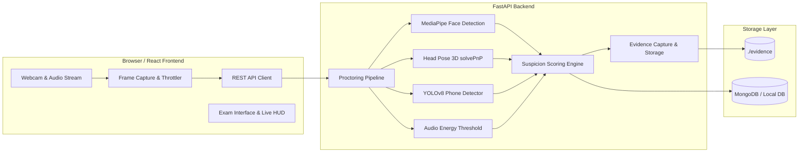

# AI-Based Smart Examination Proctoring System
### Using Computer Vision, Deep Learning, and Machine Learning

[](https://www.python.org/)
[](https://fastapi.tiangolo.com/)
[](https://reactjs.org/)
[](https://opencv.org/)
[](https://developers.google.com/mediapipe)
[](https://ultralytics.com/)

---

## 1. Project Overview

The **AI-Based Smart Examination Proctoring System** is an end-to-end web-based automated monitoring and examination platform engineered for academic institutions. Utilizing real-time computer vision algorithms and audio analysis, the system monitors candidate behavior during examinations to automatically detect, timestamp, and record potential academic anomalies without invasive surveillance or unwarranted automated disqualification.

The platform provides an **explainable suspicion scoring engine** that serves as an intelligent review aid for human proctors, generating detailed audit reports and evidence captures for post-exam inspection.

---

## 2. Key Features & Capabilities

### 🎓 Student Candidate Experience
- **Biometric Face Enrollment**: Secure facial reference capture during registration for pre-exam comparison.
- **5-Point System Hardware Check**: Real-time verification of camera, microphone, ambient lighting sufficiency, single-candidate presence, and facial identity match before exam access.
- **Distraction-Free Exam Interface**: Responsive question palette, multi-choice options, mark-for-review flags, dynamic countdown timer with automatic submission on expiration, and background answer auto-saving.
- **AI Telemetry HUD**: Live mini-webcam preview displaying real-time head pose direction, ambient audio level, and proctor risk classification.

### 🛡️ AI & Computer Vision Proctoring Engine
- **Face Presence & Absence Monitoring**: Detects missing candidates (`FACE_NOT_DETECTED`, `STUDENT_ABSENT`) with consecutive frame thresholds.
- **Multi-Person Detection**: Flags secondary unauthorized individuals entering camera view (`MULTIPLE_PERSONS_DETECTED`).
- **3D Head Pose & Gaze Estimation**: Analyzes facial landmark geometry (Pitch, Yaw, Roll) via solvePnP to identify prolonged looking away (`LOOKING_LEFT`, `LOOKING_RIGHT`, `LOOKING_UP`, `LOOKING_DOWN`).
- **Mobile Phone & Prohibited Device Detection**: YOLOv8 neural network object detection for unauthorized cell phones, tablets, or books (`MOBILE_PHONE_DETECTED`).
- **Ambient Acoustic Energy Monitoring**: Web Audio API RMS energy meter flags continuous talking or loud background activity (`AUDIO_ACTIVITY_DETECTED`) without storing private conversations.
- **Evidence Snapshot Capture**: Debounced automated image captures stored with localized bounding boxes and confidence metrics.

### 👨‍💼 Administrator & Proctor Dashboard
- **Analytics & Trends**: High-level KPIs, incident type breakdown charts, and suspicion score distribution graphs.
- **Live Surveillance Room**: Multi-candidate live surveillance grid with real-time video feeds, latest event tags, and 1-click warning message dispatch.
- **Course & Question Bank**: Full CRUD for examination courses, durations, passing scores, and multiple-choice questions.
- **Comprehensive Audit Reports**: Downloadable and printable audit documents containing candidate info, score, incident breakdown, chronological timeline, and high-resolution evidence gallery.

### 🎯 College Viva & Demo Simulation Mode
- Interactive one-click simulation toolbar to demonstrate specific AI anomaly triggers (Phone Detected, Multi-Person, Looking Away, Audio Spike) with instant visual feedback and score calculation for college evaluators.

---

## 3. Technology Stack

| Layer | Technologies |
|---|---|
| **Frontend** | React 18, Vite, Chart.js, Lucide Icons, Canvas Confetti, Vanilla CSS3 |
| **Backend** | Python 3.11, FastAPI, Uvicorn, Pydantic, PyJWT, Bcrypt, Python-Multipart |
| **AI / CV** | OpenCV, MediaPipe FaceMesh & Face Detection, Ultralytics YOLOv8, NumPy, Pillow |
| **Database** | MongoDB with resilient file-backed fallback data store |
| **Audio** | Web Audio API RMS energy analyzer |

---

## 4. Architecture & Data Flow



---

## 5. Explainable Suspicion Scoring Matrix

Suspicion points are calculated based on configurable weights with cooldown debouncing to prevent repetitive triggers:

| Flagged Anomaly Event | Default Weight | Risk Classification |
|---|---|---|
| `MOBILE_PHONE_DETECTED` | **+50 pts** | High |
| `MULTIPLE_PERSONS_DETECTED` | **+40 pts** | High |
| `STUDENT_ABSENT` | **+30 pts** | High |
| `FACE_NOT_DETECTED` | **+20 pts** | Medium |
| `AUDIO_ACTIVITY_DETECTED` | **+20 pts** | Medium |
| `SUSPICIOUS_HEAD_MOVEMENT` | **+10 pts** | Low / Medium |
| `TAB_SWITCH_DETECTED` | **+15 pts** | Medium |

### Risk Categories:
- **LOW RISK (0 – 29 pts)**: Normal candidate behavior with minor natural movements.
- **MEDIUM RISK (30 – 59 pts)**: Occasional head turns or ambient noise requiring automated logging.
- **HIGH RISK (60+ pts)**: Multiple severe triggers (e.g. mobile phone + multi-person) requiring manual proctor audit.

---

## 6. Installation & Quick Start

### Prerequisites
- **Python 3.10+** (Python 3.11 recommended)
- **Node.js 18+** & **npm**

### Step 1: Clone and Navigate
```bash
git clone <repository_url>
cd smart-exam-proctoring
```

### Step 2: Set Up Backend
```bash
# Install Python dependencies
python -m pip install -r requirements.txt

# Create environment configuration
cp .env.example .env
```

### Step 3: Set Up Frontend
```bash
cd frontend
npm install
cd ..
```

### Step 4: Run the Complete System
**Windows Launcher:**
Double-click `run_system.bat` or run:
```powershell
.\run_system.ps1
```

**Manual Start:**
Terminal 1 (Backend):
```bash
python -m uvicorn backend.app:app --host 127.0.0.1 --port 8000 --reload
```

Terminal 2 (Frontend):
```bash
cd frontend
npm run dev
```

Open your browser at **`http://localhost:5173`**.

---

## 7. Demo Credentials for Viva Evaluation

| Role | Email | Password |
|---|---|---|
| **Chief Proctor (Admin)** | `admin@proctor.edu` | `Admin@123` |
| **Student Candidate** | `student@proctor.edu` | `Student@123` |
| **Alternate Student** | `emily@proctor.edu` | `Student@123` |

---

## 8. REST API Endpoints Overview

| Method | Endpoint | Description |
|---|---|---|
| `POST` | `/api/auth/register` | Register new student profile with face baseline |
| `POST` | `/api/auth/login` | Authenticate user and issue JWT bearer token |
| `GET` | `/api/auth/me` | Fetch authenticated user profile |
| `GET` | `/api/exams` | List all active exams |
| `POST` | `/api/exams` | Create new examination (Admin only) |
| `GET` | `/api/exams/{id}` | Fetch exam details and question bank |
| `POST` | `/api/attempts/start` | Initialize student exam session attempt |
| `POST` | `/api/attempts/{id}/answer` | Auto-save answer choice or review flag |
| `POST` | `/api/attempts/{id}/submit` | Final submission and auto-grading |
| `POST` | `/api/proctoring/system-check`| Pre-exam lighting and hardware validator |
| `POST` | `/api/proctoring/verify-face` | Verify live query face against reference |
| `POST` | `/api/proctoring/frame` | Real-time AI computer vision analysis pipeline |
| `POST` | `/api/demo/simulate` | Trigger viva demonstration simulation event |
| `GET` | `/api/admin/dashboard` | Fetch aggregated analytics & incident metrics |
| `GET` | `/api/admin/sessions` | Fetch real-time active sessions for surveillance |
| `GET` | `/api/admin/reports/{id}` | Generate comprehensive candidate audit report |

---

## 9. Project Limitations & Ethical Considerations

1. **Indicative Scoring**: AI suspicion scores serve as a triage and review tool for human proctors. The system is designed to provide transparent evidence and does not automatically disqualify or terminate exams without human oversight.
2. **Lighting & Webcams**: Extreme darkness or poor webcams may impact facial landmark precision; the system includes a pre-exam lighting check to prevent false flags.
3. **Privacy Compliance**: Ambient audio is processed in memory for RMS energy levels only; audio recordings of private conversations are not stored on disk.

---

## 10. License & Academic Attribution
Developed for Final Year Major Project / AI & Computer Vision Portfolio. Licensed under the MIT License.
